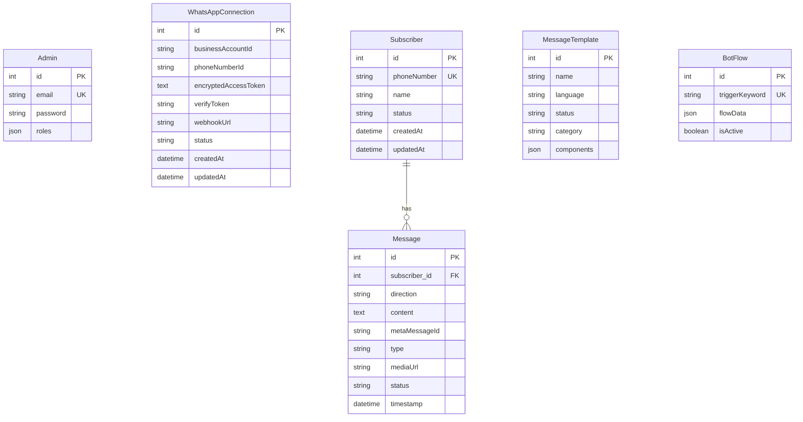

# OpenSquadron Codebase Context & Analysis

OpenSquadron is an open-source, Symfony-based alternative to commercial marketing and live chat platforms like ManyChat, Chatfuel, and Wati. It implements the underlying framework and Meta WhatsApp Cloud API connectivity for a Shared Live Inbox, Subscriber management, template syncing, and keyword-triggered bot automation flows.

---

## 1. Core Technology Stack
* **PHP**: `>=8.2`
* **Framework**: Symfony `7.4.*`
* **ORM / Database**: Doctrine ORM (`doctrine/orm` `^3.6`, `doctrine/doctrine-bundle` `^2.18`) with MySQL/MariaDB database compatibility.
* **Templating Engine**: Twig (`symfony/twig-bundle` `7.4.*`) featuring a modern glassmorphism design system.
* **HTTP Client**: Symfony Http Client (`symfony/http-client` `7.4.*`) to interface with Meta's Graph API.
* **Security & Auth**: Symfony Security Bundle (`symfony/security-bundle` `7.4.*`) configuring form logins, secure logout, and path-based firewalls for Admin routes.
* **Local Hosting & Tunneling**: XAMPP Integration + Cloudflared CLI (Cloudflare Tunnel) to pipe Meta's webhook POST requests to the local environment.

---

## 2. Directory Structure & Key Files

Below is a breakdown of the key files in the OpenSquadron project directory. Each link is a relative reference to the file in the project:

### ⚙️ Configuration & Project Setup
* [composer.json](composer.json) — Defines PHP dependencies, PSR-4 autoload rules (`App\` mapped to `src/`), and development scripts.
* [example.env](example.env) — Provides environment variable templates including database connection URI and Meta API credentials.
* [setup-local.ps1](setup-local.ps1) — An Administrator PowerShell script that configures XAMPP VirtualHost bindings for `opensquadron.local`.
* [start-tunnel.bat](start-tunnel.bat) — A batch launcher to initiate the Cloudflare Tunnel using a customizable token.
* [start-cf.bat](start-cf.bat) — Batch launcher with a pre-configured Cloudflare Tunnel token.
* [test_webhook.php](test_webhook.php) — A local cURL test script that mimics Meta's WhatsApp webhook callback payload, facilitating local validation of message parsing and auto-replies.
* [config/services.yaml](config/services.yaml) — Defines container configuration parameters, autowiring, and autoconfiguration defaults.
* [config/packages/security.yaml](config/packages/security.yaml) — Handles the admin firewall configuration, password hashing, and endpoint-level authorization rules (e.g., locking `/admin` routes to `ROLE_ADMIN`).

### 📦 Database Entities (Models)
* [Admin.php](src/Entity/Admin.php) — Represents the backend platform administrator user, implementing `UserInterface` and `PasswordAuthenticatedUserInterface`.
* [WhatsAppConnection.php](src/Entity/WhatsAppConnection.php) — Stores Meta credentials (Business Account ID, Phone Number ID, encrypted Access Token, Verify Token, and Webhook URL) for the workspace connection.
* [Subscriber.php](src/Entity/Subscriber.php) — Represents a user who has engaged with the WhatsApp Business channel. Stores the phone number, profile name, and system metadata.
* [Message.php](src/Entity/Message.php) — Models chat messages, including direction (inbound/outbound), type (text, image, audio, template), status, content, media URL, timestamps, and Meta's unique message ID.
* [MessageTemplate.php](src/Entity/MessageTemplate.php) — Caches WhatsApp templates approved by Meta, storing name, language, status, category, and structural components.
* [BotFlow.php](src/Entity/BotFlow.php) — Stores keyword-triggered auto-reply rule maps as JSON schemas containing action pipelines (e.g., text responses).

### 🛠️ Core Services
* [WhatsAppConnectionService.php](src/Service/WhatsAppConnectionService.php) — The primary layer for Meta API communication. It encapsulates symmetric token encryption/decryption (AES-256-GCM using `APP_SECRET`), validates credentials against the Meta Graph API, transmits text/media/template messages, creates templates, and downloads media payloads to the local storage.

### 🎮 Controllers (HTTP Handlers)
* [SecurityController.php](src/Controller/SecurityController.php) — Intercepts login and logout route firewalls.
* [DashboardController.php](src/Controller/DashboardController.php) — Renders the administrator landing area and platform overview.
* [ConnectionSetupController.php](src/Controller/ConnectionSetupController.php) — Manages the forms to capture, validate, and store Meta Business Account settings.
* [WhatsAppController.php](src/Controller/WhatsAppController.php) — Exposes `/webhook/whatsapp` for incoming GET requests (webhook verification challenge) and POST requests (handling incoming messages, downloading media, triggering bot flows). Also provides a test route `/whatsapp/test`.
* [LiveChatController.php](src/Controller/LiveChatController.php) — Renders the Shared Inbox user interface, listing subscribers and message history. Includes AJAX endpoints for sending text messages, media uploads, and message templates.
* [BotManagerController.php](src/Controller/BotManagerController.php) — Handles chatbot automation dashboard controls, syncing templates from Meta, submitting template draft payloads, and editing keyword Bot Flows.
* [PolicyController.php](src/Controller/PolicyController.php) — Renders basic, Meta-compliant Terms of Service and Privacy Policy templates to satisfy Meta app validation.

### 🖥️ User Interface Layouts (Twig Templates)
* [base.html.twig](templates/base.html.twig) — System-wide boilerplate styling containing a premium dark-mode, glassmorphic design theme with responsive side/top navigation.
* [inbox.html.twig](templates/chat/inbox.html.twig) — Full-screen Shared Inbox template containing active chat sidebars, bubbles for inbound/outbound files, attachment modals, and manual polling javascript (which reloads the history frame every 10 seconds if idle).
* [flows.html.twig](templates/bot_manager/flows.html.twig) — Visual interface to configure keyword triggers and sequence response events.
* [templates.html.twig](templates/bot_manager/templates.html.twig) — Template creation form and synced templates list.
* [index.html.twig (Bot Manager)](templates/bot_manager/index.html.twig) — Routing dashboard for bot configuration.
* [connect.html.twig](templates/whatsapp/connect.html.twig) — UI for editing and checking connection parameters.
* [login.html.twig](templates/security/login.html.twig) — Admin login screen.
* [privacy.html.twig](templates/policy/privacy.html.twig) — Privacy policy boilerplate.
* [terms.html.twig](templates/policy/terms.html.twig) — Terms of Service boilerplate.

### 💻 CLI Console Commands
* [CreateAdminCommand.php](src/Command/CreateAdminCommand.php) — Accessible via `C:\xampp\php\php.exe bin/console app:create-admin <email> <password>`. Persists a new `Admin` record with a hashed password and `ROLE_ADMIN` permissions.

---

## 3. Database Schema Blueprint
The schema maps out the relations between subscribers, connection states, message templates, and individual message logs.



---

## 4. Key Workflows & Execution Flows

### 📬 Incoming Webhook Flow (Message Reception)
When an external user sends a WhatsApp message to the registered Business Phone Number, Meta fires a webhook POST request to OpenSquadron:


---

## 5. Security & Encryption Details
To avoid exposing sensitive Meta credentials (such as permanent Access Tokens) in plain text within the database:
1. **Symmetric Encryption**: When saving credentials through [ConnectionSetupController](src/Controller/ConnectionSetupController.php), the plain access token is passed to [WhatsAppConnectionService](src/Service/WhatsAppConnectionService.php).
2. **Cipher Algorithm**: The service utilizes `aes-256-gcm`.
3. **Encryption Mechanism**:
   * Uses the application's unique `APP_SECRET` (configured via env variables) hashed into a key via `sha256`.
   * Generates a cryptographically secure random Initialization Vector (IV).
   * Encrypts the token and returns a Base64-encoded string concatenation of the IV, tag, and ciphertext:
     $$\text{Encrypted Token} = \text{Base64}(\text{IV} \mathbin{\Vert} \text{Tag} \mathbin{\Vert} \text{Ciphertext})$$
4. **Decryption on Request**: When performing outbound API calls, the string is disassembled, authenticated using the tag, and decrypted back to the raw Bearer token dynamically.

---

## 6. How to Set Up & Test Locally

To initiate development or run a local instance of OpenSquadron, follow these commands:

### A. Environment Provisioning
Ensure XAMPP is active (Apache & MySQL).

1. **Install Dependencies**:
   ```bash
   composer install
   ```
2. **Generate Virtual Host Configuration** (Requires administrator shell):
   ```powershell
   ./setup-local.ps1
   ```
   *This links `opensquadron.local` to the `/public` root folder in the XAMPP virtual hosts list.*
3. **Configure Settings**:
   Copy `example.env` to `.env` and verify database URL details.
4. **Migrate Database Schema**:
   ```bash
   C:\xampp\php\php.exe bin/console doctrine:database:create
   C:\xampp\php\php.exe bin/console doctrine:migrations:migrate
   ```
5. **Register Admin User**:
   ```bash
   C:\xampp\php\php.exe bin/console app:create-admin admin@example.com password123
   ```

### B. Tunneling and Webhooks Setup
1. **Expose Local Endpoint**:
   Launch the Cloudflare tunnel client to map your Zero Trust domain route to `http://opensquadron.local:80`:
   ```bash
   # Run pre-configured tunnel batch script:
   start-cf.bat
   ```
2. **Meta Callback Connection**:
   * In your Meta Developer console under WhatsApp Configuration, paste your public URL:
     `https://opensquadron.your.domain/webhook/whatsapp`
   * Provide the `Verify Token` matching your configuration database.
   * Subscribe to the `messages` webhook field.

### C. Simulating Webhooks Locally
If you do not have a Meta Developer account set up, you can verify message processing locally:
1. Ensure Apache is running on port 80 (serving the application).
2. Run the webhook simulation script:
   ```bash
   C:\xampp\php\php.exe test_webhook.php
   ```
   *This fires a cURL command mimicking an inbound message from "John Doe" (`15551234567`) saying "Hello from local test!". You will see the response, and the user will appear in the Shared Inbox.*
