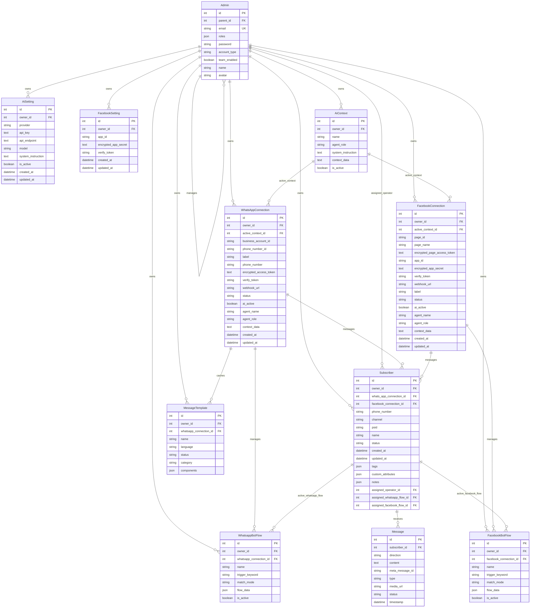
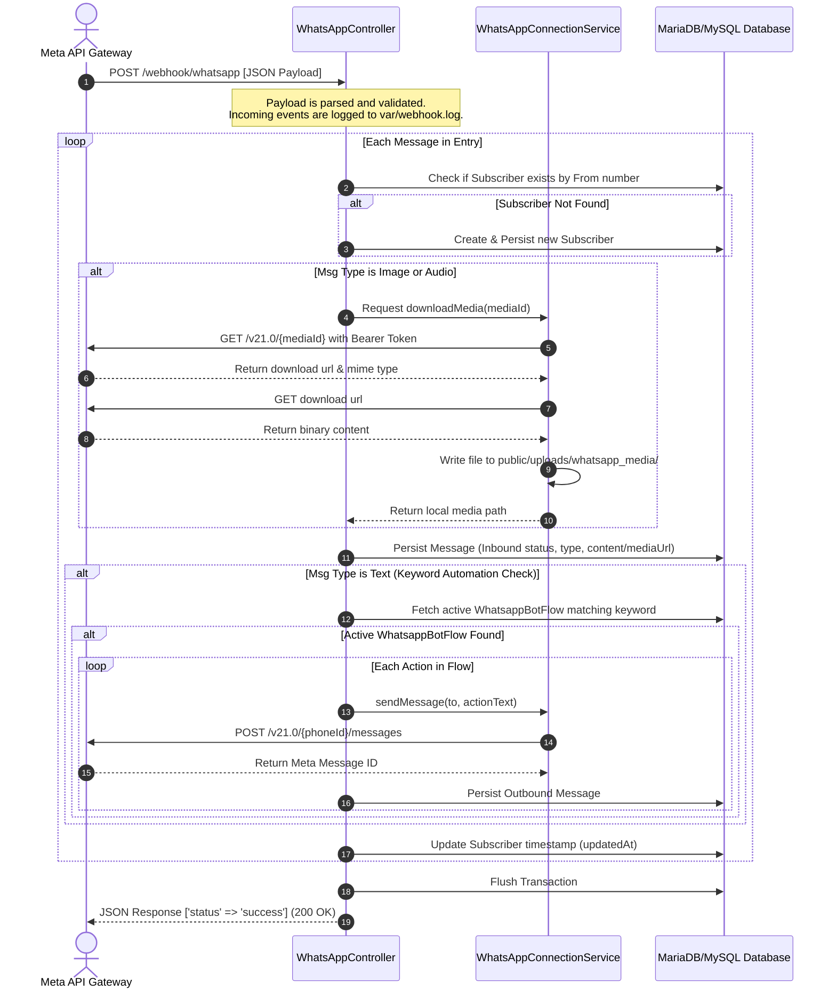

# OpenSquadron Codebase Context & Analysis

OpenSquadron is an open-source, Symfony-based alternative to commercial marketing and live chat platforms like ManyChat, Chatfuel, and Wati. It implements the underlying framework and Meta WhatsApp Cloud API connectivity for a Shared Live Inbox, Subscriber management, template syncing, and keyword-triggered bot automation flows.

---

## 1. Core Technology Stack
* **PHP**: `>=8.2`
* **Framework**: Symfony `7.4.*`
* **ORM / Database**: Doctrine ORM (`doctrine/orm` `^3.6`, `doctrine/doctrine-bundle` `^2.18`) with MySQL/MariaDB database compatibility.
* **Templating Engine**: Twig (`symfony/twig-bundle` `7.4.*`) featuring a modern glassmorphism design system.
* **HTTP Client**: Symfony Http Client (`symfony/http-client` `7.4.*`) to interface with Meta's Graph API.
* **Security & Auth**: Symfony Security Bundle (`symfony/security-bundle` `7.4.*`) configuring form logins, secure logout, and path-based access control for administrative endpoints.
* **Local Hosting & Tunneling**: XAMPP Integration + Cloudflared CLI (Cloudflare Tunnel) to pipe Meta's webhook POST requests to the local environment.

---

## 2. Directory Structure & Key Files

Below is a breakdown of the key files in the OpenSquadron project directory. Each link is a reference to the file in the project:

### ⚙️ Configuration & Project Setup
* [composer.json](composer.json) — Defines PHP dependencies, PSR-4 autoload rules (`App\` mapped to `src/`), and development scripts.
* [example.env](example.env) — Provides environment variable templates including database connection URI and Meta API credentials.
* [setup-local.ps1](setup-local.ps1) — An Administrator PowerShell script that configures XAMPP VirtualHost bindings for `opensquadron.local`.
* [start-tunnel.bat](start-tunnel.bat) — A batch launcher to initiate the Cloudflare Tunnel using a customizable token.
* [start-cf.bat](start-cf.bat) — Batch launcher with a pre-configured Cloudflare Tunnel token.
* [test_webhook.php](test_webhook.php) — A local cURL test script that mimics Meta's WhatsApp webhook callback payload, facilitating local validation of message parsing and auto-replies.
* [config/services.yaml](config/services.yaml) — Defines container configuration parameters, autowiring, and autoconfiguration defaults.
* [config/packages/security.yaml](config/packages/security.yaml) — Handles the firewall configuration, password hashing, and endpoint-level authorization rules (locking secure administrative routes like `/inbox`, `/subscribers`, `/whatsapp-business/connect`, `/facebook/connect`, etc. to `ROLE_ADMIN`).

### 📦 Database Entities (Models)
* [Admin.php](src/Entity/Admin.php) — Represents the platform administrator user and sub-account operators. Implements `UserInterface` and `PasswordAuthenticatedUserInterface`.
* [TenantAwareInterface.php](src/Entity/TenantAwareInterface.php) — Interface implemented by tenant-owned entities (associated with an `owner_id` referencing an `Admin`) for workspace safety checks.
* [WhatsAppConnection.php](src/Entity/WhatsAppConnection.php) — Stores Meta credentials (Business Account ID, Phone Number ID, display phone number, encrypted Access Token, Verify Token, and Webhook URL) for a WhatsApp connection, linking to an active `AiContext`.
* [FacebookConnection.php](src/Entity/FacebookConnection.php) — Stores Meta credentials (Page ID, Page name, encrypted page Access Token, App ID, App Secret, Verify Token, and Webhook URL) for a Facebook connection, linking to an active `AiContext`.
* [FacebookSetting.php](src/Entity/FacebookSetting.php) — Holds the workspace global Facebook login credentials (App ID, App Secret, and optional Verify Token).
* [Subscriber.php](src/Entity/Subscriber.php) — Represents a user who has engaged with the WhatsApp Business or Facebook Messenger channels.
* [Message.php](src/Entity/Message.php) — Models chat messages, including direction (inbound/outbound), type (text, image, audio, template), status, content, media URL, timestamps, and Meta's unique message ID.
* [MessageTemplate.php](src/Entity/MessageTemplate.php) — Caches WhatsApp templates approved by Meta, storing name, language, status, category, and structural components.
* [WhatsappBotFlow.php](src/Entity/WhatsappBotFlow.php) — Stores keyword-triggered auto-reply rule maps as JSON flow data for WhatsApp Business.
* [FacebookBotFlow.php](src/Entity/FacebookBotFlow.php) — Stores keyword-triggered auto-reply rule maps as JSON flow data for Facebook Page Messenger.
* [AiSetting.php](src/Entity/AiSetting.php) — Holds global configuration for AI integration, storing the active API provider (OpenAI, Gemini, Moonshot, DeepSeek, OpenRouter, Custom), endpoints, models, and API keys.
* [AiContext.php](src/Entity/AiContext.php) — Represents custom bot personas and knowledge bases (RAG data) shared across WhatsApp and Facebook connections.

### 🛠️ Core Services
* [WhatsAppConnectionService.php](src/Service/WhatsAppConnectionService.php) — Encapsulates symmetric token encryption/decryption, validates credentials against the Meta Graph API, transmits text/media/template messages, and manages template synchronization.
* [FacebookService.php](src/Service/FacebookService.php) — Encapsulates Facebook Login for Business flow, processes Page OAuth exchanges, saves Facebook settings and connections, and transmits messages to the Facebook Page webhooks.
* [AiAgentService.php](src/Service/AiAgentService.php) — Handles prompts format and API calls to AI providers (OpenAI, Gemini, Moonshot, DeepSeek, OpenRouter, Custom) to generate automated responses.
* [WhatsappBotFlowExecutor.php](src/Service/WhatsappBotFlowExecutor.php) — Executes keyword-triggered chatbot automation response pipelines for WhatsApp messages.
* [FacebookBotFlowExecutor.php](src/Service/FacebookBotFlowExecutor.php) — Executes keyword-triggered chatbot automation response pipelines for Facebook Page messages.
* [TenantContext.php](src/Service/TenantContext.php) — Manages the current active tenant/workspace session context dynamically.
* [TenantDatabaseService.php](src/Service/TenantDatabaseService.php) — Filters and secures data operations to enforce workspace multi-tenant isolation.

### 🎮 Controllers (HTTP Handlers)
* [SecurityController.php](src/Controller/SecurityController.php) — Intercepts login and logout route firewalls.
* [DashboardController.php](src/Controller/DashboardController.php) — Renders the administrator landing area, platform overview, and metrics.
* [ConnectionSetupController.php](src/Controller/ConnectionSetupController.php) — Manages forms to capture, validate, update, and delete WhatsApp connection parameters at `/whatsapp-business/connect`.
* [FacebookConnectionController.php](src/Controller/FacebookConnectionController.php) — Handles Facebook settings, OAuth flow, page selector screens, and connection storage under `/facebook/connect`.
* [WhatsAppController.php](src/Controller/WhatsAppController.php) — Exposes `/webhook/whatsapp` for verification challenges, inbound messages processing, media downloads, and bot trigger executions.
* [FacebookWebhookController.php](src/Controller/FacebookWebhookController.php) — Exposes `/webhook/facebook` for page messages, postback events, and data deletion status callbacks.
* [LiveChatController.php](src/Controller/LiveChatController.php) — Renders the Shared Live Inbox user interface, handles message synchronization frames, and supports sending free-form responses or templates.
* [WhatsappBotManagerController.php](src/Controller/WhatsappBotManagerController.php) — Handles WhatsApp bot settings, syncs/creates Meta templates, and updates keyword flows.
* [FacebookBotManagerController.php](src/Controller/FacebookBotManagerController.php) — Handles Facebook bot settings and updates keyword flows.
* [AiSettingsController.php](src/Controller/AiSettingsController.php) — Manages global AI Settings configurations and context profiles.
* [SubscriberController.php](src/Controller/SubscriberController.php) — Manages subscribers list, tagging, custom attributes, notes, and operator assignments.
* [AccountManagementController.php](src/Controller/AccountManagementController.php) — Handles registration of operators, workspace delegation, and sub-account access profiles.
* [AccountExtrasController.php](src/Controller/AccountExtrasController.php) — Contains secondary account routes and password settings.
* [PolicyController.php](src/Controller/PolicyController.php) — Renders Meta-compliant public Terms of Service and Privacy Policy pages.

### 🖥️ User Interface Layouts (Twig Templates)
* [base.html.twig](templates/base.html.twig) — System-wide glassmorphism layout containing navigation headers and the UI theme.
* [inbox.html.twig](templates/chat/inbox.html.twig) — Full-screen Shared Inbox UI supporting both WhatsApp and Facebook messaging.
* [connect.html.twig](templates/whatsapp/connect.html.twig) — WhatsApp connection settings and credentials wizard.
* [connect.html.twig](templates/facebook/connect.html.twig) — Facebook settings, OAuth triggers, and verification setup.
* [select_pages.html.twig](templates/facebook/select_pages.html.twig) — Authorised Facebook Page listing selector dashboard.
* [settings.html.twig](templates/facebook/settings.html.twig) — Page settings configuration and status checker.
* [flows.html.twig](templates/whatsapp_bot_manager/flows.html.twig) — Visual automation designer for WhatsApp bot keywords.
* [flows.html.twig](templates/facebook_bot_manager/flows.html.twig) — Visual automation designer for Facebook bot keywords.
* [login.html.twig](templates/security/login.html.twig) — Admin login screen.
* [privacy.html.twig](templates/policy/privacy.html.twig) — Privacy policy boilerplate.
* [terms.html.twig](templates/policy/terms.html.twig) — Terms of Service boilerplate.

### 💻 CLI Console Commands
* [CreateAdminCommand.php](src/Command/CreateAdminCommand.php) — Accessible via `C:\xampp\php\php.exe bin/console app:create-admin <email> <password>`. Persists a new `Admin` record with a hashed password and `ROLE_ADMIN` permissions.

---

## 3. Database Schema Blueprint
The schema maps out the relations between subscribers, connection states, message templates, and individual message logs.



---

## 4. Key Workflows & Execution Flows

### 🤖 AI Agent Responder Integration
The system includes `AiAgentService`, which acts as an integration layer to various Large Language Models (LLMs) including OpenAI, Google Gemini, Moonshot Kimi, DeepSeek, and OpenRouter. 
- **Global Config**: Admins define the global AI provider and API keys via `AiSetting`.
- **Context Profiles**: Admins can construct detailed bot personas containing instructions and knowledge-base data (`AiContext`).
- **Bot-Level Activation**: Individual WhatsApp connections can activate AI responses and select a specific `AiContext` profile. When enabled, incoming messages that don't trigger keyword BotFlows are routed through the LLM, grounded in the context data to answer subscriber queries.

### 📬 Incoming Webhook Flow (Message Reception)
When an external user sends a WhatsApp message to the registered Business Phone Number, Meta fires a webhook POST request to OpenSquadron:



---

## 5. Security & Encryption Details
To avoid exposing sensitive Meta credentials (such as permanent Access Tokens and App Secrets) in plain text within the database:
1. **Symmetric Encryption**: When saving credentials through [ConnectionSetupController](src/Controller/ConnectionSetupController.php) or [FacebookConnectionController](src/Controller/FacebookConnectionController.php), the plain access tokens and app secrets are encrypted via [WhatsAppConnectionService](src/Service/WhatsAppConnectionService.php) or [FacebookService](src/Service/FacebookService.php) respectively.
2. **Cipher Algorithm**: The service utilizes `aes-256-gcm`.
3. **Encryption Mechanism**:
   * Uses the application's unique `APP_SECRET` (configured via env variables) hashed into a key via `sha256`.
   * Generates a cryptographically secure random Initialization Vector (IV).
   * Encrypts the token and returns a Base64-encoded string concatenation of the IV, tag, and ciphertext:
     $$\text{Encrypted Token} = \text{Base64}(\text{IV} \mathbin{\Vert} \text{Tag} \mathbin{\Vert} \text{Ciphertext})$$
4. **Decryption on Request**: When performing outbound API calls, the string is disassembled, authenticated using the tag, and decrypted back to the raw Bearer token dynamically.

---

## 6. How to Set Up & Test Locally

To initiate development or run a local instance of OpenSquadron, follow these commands:

### A. Environment Provisioning
Ensure XAMPP is active (Apache & MySQL).

1. **Install Dependencies**:
   ```bash
   composer install
   ```
2. **Generate Virtual Host Configuration** (Requires administrator shell):
   ```powershell
   ./setup-local.ps1
   ```
   *This links `opensquadron.local` to the `/public` root folder in the XAMPP virtual hosts list.*
3. **Configure Settings**:
   Copy `example.env` to `.env` and verify database URL details.
4. **Migrate Database Schema**:
   ```bash
   C:\xampp\php\php.exe bin/console doctrine:database:create
   C:\xampp\php\php.exe bin/console doctrine:migrations:migrate
   ```
5. **Register Admin User**:
   ```bash
   C:\xampp\php\php.exe bin/console app:create-admin admin@example.com password123
   ```

### B. Tunneling and Webhooks Setup
1. **Expose Local Endpoint**:
   Launch the Cloudflare tunnel client to map your Zero Trust domain route to `http://opensquadron.local:80`:
   ```bash
   # Run pre-configured tunnel batch script:
   start-cf.bat
   ```
2. **Meta Callback Connection**:
   * In your Meta Developer console under WhatsApp Configuration, paste your public URL:
     `https://opensquadron.your.domain/webhook/whatsapp`
   * Provide the `Verify Token` matching your configuration database.
   * Subscribe to the `messages` webhook field.

### C. Simulating Webhooks Locally
If you do not have a Meta Developer account set up, you can verify message processing locally:
1. Ensure Apache is running on port 80 (serving the application).
2. Run the webhook simulation script:
   ```bash
   C:\xampp\php\php.exe test_webhook.php
   ```
   *This fires a cURL command mimicking an inbound message from "John Doe" (`15551234567`) saying "Hello from local test!". You will see the response, and the user will appear in the Shared Inbox.*
